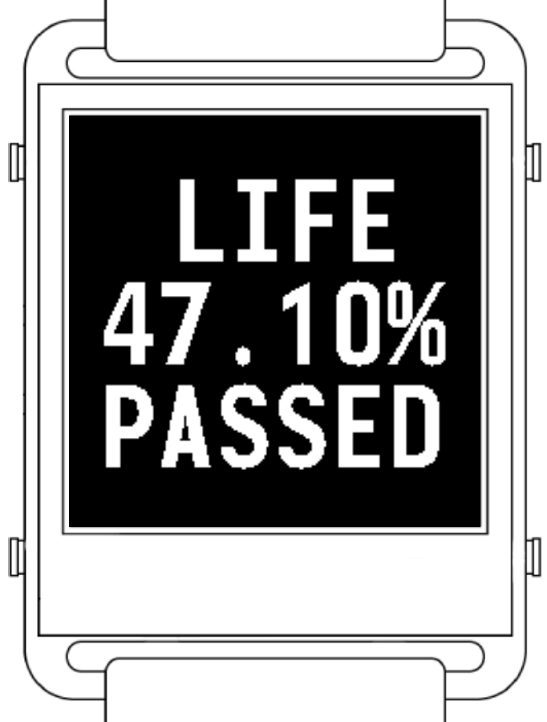

# NOW: #01 - Feeling alive



## Description

This piece was primarily created as a reminder of the fleeting nature of time and our lives. It shows the percentage of life elapsed, based on a total lifespan of 4,000 weeks—a concept inspired by Oliver Burkeman's influential work on time and life. His book significantly shaped my perception of both.

Initially, this piece existed as a personal artifact without a name. However, during a recent conversation, someone asked me, "What makes you feel alive?" This question inspired me to see this piece as not just a reminder of mortality but as a way to feel truly alive. While many might perceive this constant reminder as depressive or even masochistic, I find it deeply motivating. It compels me to look forward, constantly questioning my motivations and experiences in the present moment.

## Setup
1. Follow initial setup from the [README](../README.md) file
2. In the file [FaceNow.h](/01_FeelingAlive/Now_01_FeelingAlive/FaceNow.h) setup your birthday
```
#define BIRTHDAY_Y xxxx
#define BIRTHDAY_M xx
#define BIRTHDAY_D xx
```